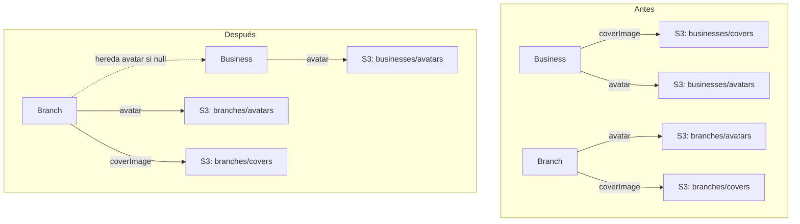

# Documento de Diseño

## Visión General

Este diseño detalla los cambios necesarios para eliminar el campo `coverImage` del modelo Business, mantener las imágenes en Branch, e implementar la herencia de avatar desde el negocio hacia las sucursales que no tengan avatar propio.

El enfoque es minimalista: eliminar código y campos innecesarios del Business, y agregar lógica de resolución inteligente en los tipos GraphQL de Branch para la herencia de avatar.

## Arquitectura



## Componentes e Interfaces

### 1. Modelo Business (models.py)

**Cambios:**
- Eliminar campo `coverImage: Optional[str] = None`

```python
class Business(BaseModel):
    id: str = Field(alias="_id")
    name: str
    ownerId: str
    globalRating: float
    avatar: str  # Mantiene avatar (requerido o vacío)
    # coverImage: ELIMINADO
    description: Optional[str] = None
    socialMedia: Optional[Dict[str, str]] = None
    tags: List[str] = []
    isActive: bool = True
    createdAt: datetime
```

### 2. BusinessType GraphQL (schema/businesses/types.py)

**Cambios:**
- Eliminar campo `coverImage: Optional[str]`
- Eliminar método `cover_url()`

```python
@strawberry.type
class BusinessType:
    id: str
    name: str
    ownerId: str
    globalRating: float
    avatar: Optional[str]
    # coverImage: ELIMINADO
    # cover_url(): ELIMINADO
    description: Optional[str]
    socialMedia: Optional[strawberry.scalars.JSON]
    tags: List[str]
    isActive: bool
    createdAt: datetime

    @strawberry.field(description="Presigned URL for the business avatar")
    def avatar_url(self) -> Optional[str]:
        if self.avatar:
            return generate_presigned_url(self.avatar)
        return None
```

### 3. Business Inputs (schema/businesses/inputs.py)

**Cambios:**
- Eliminar `coverImage` de `CreateBusinessInput`
- Eliminar `coverImage` de `UpdateBusinessInput`

```python
@strawberry.input
class CreateBusinessInput:
    name: str
    avatar: Optional[str] = None
    # coverImage: ELIMINADO
    description: Optional[str] = None
    socialMedia: Optional[JSON] = None
    tags: Optional[List[str]] = None

@strawberry.input
class UpdateBusinessInput:
    name: Optional[str] = None
    description: Optional[str] = None
    socialMedia: Optional[JSON] = None
    tags: Optional[List[str]] = None
    isActive: Optional[bool] = None
    avatar: Optional[str] = None
    # coverImage: ELIMINADO
```

### 4. Business Mutations (schema/businesses/mutations.py)

**Cambios:**
- Eliminar referencias a `coverImage` en `register_business`
- Eliminar manejo de `coverImage` en `update_business`

### 5. Business Repository (repositories/business_repository.py)

**Cambios:**
- Eliminar `coverImage` del payload en `create()`
- Eliminar `coverImage` del método `_point_to_business()`
- El método `update()` ignorará `coverImage` si se pasa

### 6. Branch Types con Herencia de Avatar (schema/branches/types.py)

**Cambios:**
- Modificar `avatar_url()` en `BranchType`, `NearbyBranchType`, y `ScoredBranchType` para implementar herencia

```python
@strawberry.field(description="Presigned URL for the branch avatar (inherits from business if not set)")
async def avatar_url(self, info: Info) -> Optional[str]:
    # Si la sucursal tiene avatar propio, usarlo
    if self.avatar:
        return generate_presigned_url(self.avatar)
    
    # Si no, intentar heredar del negocio padre
    from repositories import businesses_repo
    business = await businesses_repo.get_by_id(self.businessId)
    if business and business.avatar:
        return generate_presigned_url(business.avatar)
    
    return None
```

### 7. Upload Endpoints (api/endpoints/uploads.py)

**Cambios:**
- Eliminar endpoint `POST /upload/business/cover`

## Modelos de Datos

### Business (Qdrant)

```json
{
  "metadata": {
    "mongo_id": "string",
    "name": "string",
    "ownerId": "string",
    "globalRating": 0.0,
    "avatar": "string | empty",
    "description": "string | null",
    "socialMedia": {},
    "tags": [],
    "isActive": true,
    "createdAt": "ISO8601"
  }
}
```

### Branch (Qdrant) - Sin cambios

```json
{
  "metadata": {
    "mongo_id": "string",
    "businessId": "string",
    "name": "string",
    "avatar": "string | null",
    "coverImage": "string | null",
    ...
  }
}
```


## Propiedades de Correctitud

*Una propiedad es una característica o comportamiento que debe mantenerse verdadero en todas las ejecuciones válidas del sistema - esencialmente, una declaración formal sobre lo que el sistema debe hacer. Las propiedades sirven como puente entre especificaciones legibles por humanos y garantías de correctitud verificables por máquina.*

### Property 1: Avatar Inheritance Logic

*Para cualquier* sucursal y su negocio padre, el resolver `avatar_url` debe retornar:
- La URL del avatar de la sucursal si la sucursal tiene avatar propio
- La URL del avatar del negocio si la sucursal no tiene avatar pero el negocio sí
- `null` si ni la sucursal ni el negocio tienen avatar

**Validates: Requirements 4.1, 4.2, 4.3**

### Property 2: Data Integrity on Inheritance

*Para cualquier* sucursal que utiliza avatar heredado del negocio, el campo `avatar` de la sucursal en la base de datos debe permanecer sin cambios (null o vacío).

**Validates: Requirements 4.5**

### Property 3: Branch Type Consistency

*Para cualquier* datos de sucursal y negocio, todos los tipos GraphQL de Branch (`BranchType`, `NearbyBranchType`, `ScoredBranchType`) deben retornar el mismo valor de `avatar_url`.

**Validates: Requirements 6.1, 6.2, 6.3**

## Manejo de Errores

### Errores de Compatibilidad con Datos Legacy

| Escenario | Comportamiento |
|-----------|----------------|
| Business con coverImage en Qdrant | Ignorar campo, no fallar |
| Consulta GraphQL pidiendo coverImage | Campo no existe, error de schema |
| Request a /upload/business/cover | HTTP 404 Not Found |

### Errores de Herencia de Avatar

| Escenario | Comportamiento |
|-----------|----------------|
| Business padre no encontrado | Retornar null para avatar_url |
| Error de conexión a Qdrant | Propagar excepción, log error |
| Business sin avatar, Branch sin avatar | Retornar null (no es error) |

## Estrategia de Testing

### Enfoque Dual de Testing

Se utilizarán tanto tests unitarios como tests basados en propiedades:

- **Tests unitarios**: Verifican ejemplos específicos, casos edge y condiciones de error
- **Tests de propiedades**: Verifican propiedades universales a través de múltiples inputs generados

### Tests Unitarios

1. **Modelo Business**
   - Verificar que Business no tiene campo coverImage
   - Verificar que Business se puede crear sin coverImage

2. **GraphQL Types**
   - Verificar que BusinessType no expone coverImage ni cover_url
   - Verificar que BranchType mantiene coverImage y cover_url

3. **Inputs GraphQL**
   - Verificar que CreateBusinessInput no acepta coverImage
   - Verificar que UpdateBusinessInput no acepta coverImage

4. **Upload Endpoints**
   - Verificar que /upload/business/cover no existe o retorna 404

5. **Compatibilidad Legacy**
   - Verificar que _point_to_business ignora coverImage en metadata

### Tests Basados en Propiedades

Se utilizará **Hypothesis** como framework de property-based testing para Python.

**Configuración**: Mínimo 100 iteraciones por test de propiedad.

**Property Test 1: Avatar Inheritance Logic**
- Generar combinaciones aleatorias de (branch_avatar, business_avatar)
- Verificar que avatar_url retorna el valor correcto según la lógica de herencia
- Tag: **Feature: business-cover-image-removal, Property 1: Avatar Inheritance Logic**

**Property Test 2: Data Integrity**
- Generar sucursales sin avatar con negocios con avatar
- Resolver avatar_url y verificar que branch.avatar sigue siendo null
- Tag: **Feature: business-cover-image-removal, Property 2: Data Integrity on Inheritance**

**Property Test 3: Type Consistency**
- Generar datos de sucursal aleatorios
- Crear instancias de BranchType, NearbyBranchType, ScoredBranchType
- Verificar que todas retornan el mismo avatar_url
- Tag: **Feature: business-cover-image-removal, Property 3: Branch Type Consistency**

### Estructura de Tests

```
tests/
├── test_business_cover_removal.py      # Tests unitarios
└── test_avatar_inheritance_props.py    # Tests de propiedades
```
